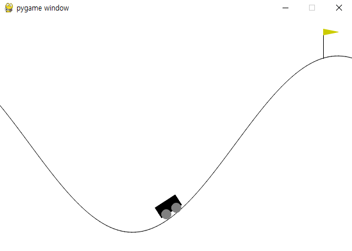

# REINFORCE

---

## cartpole_reinforce.py
basic reinforce algorithm implement with CartPole-v1 [Gym CartPole](https://gymnasium.farama.org/environments/classic_control/cart_pole/)
 
CartPole has...
- 4 Observation space (Cart position, Cart velocity, Pole Angle, Pole Angular velocity)
- Discrete action space (move left or move right, action space size is 2)
 
</img>

---

## cartpole_improved_reinforce.py
improved reinforce algorithm implement with CartPole-v1 [Gym CartPole](https://gymnasium.farama.org/environments/classic_control/cart_pole/)
 
What is improved reinforce algorithm?   
In basic reinforce, we update policy network with Gt   
But in improved reinforce, we update policy network with Gt normalization. This will help to Gt has lower variance
 
Implement   
Average all Gt history. This is b (b has no effect to Rs)   
When update Policy Network, we replace Gt to Gt - b (check cartpole_improved_reinforce.py line: 50-54)

---

## mountain_car_continuous_reinforce.py
basic reinforce algorithm implement with MountainCarContinuous-v0 [Gym MountainCarContinuous](https://www.gymlibrary.dev/environments/classic_control/mountain_car_continuous/)
 
MountainCarContinuous has...
- 2 Observation space (position of the car along x-axis, velocity of the car)
- Continuous action space (range: -1~+1, action clipped by range, multiplied power of 0.0015)
 
</img>

 
Implement    
Policy Network Output size is 2     
Output represent normal distribution, first output is mean, other is std     
Sampling action from normal distribution    

---

## moutain_Car_continuous_improved_reinforce.py
improved reinforce algorithm implement with MountainCarContinuous-v0 [Gym MountainCarContinuous](https://www.gymlibrary.dev/environments/classic_control/mountain_car_continuous/)

---

## Refer this
code is very short (under 200 lines), no need to seperate file (like PolicyNet)